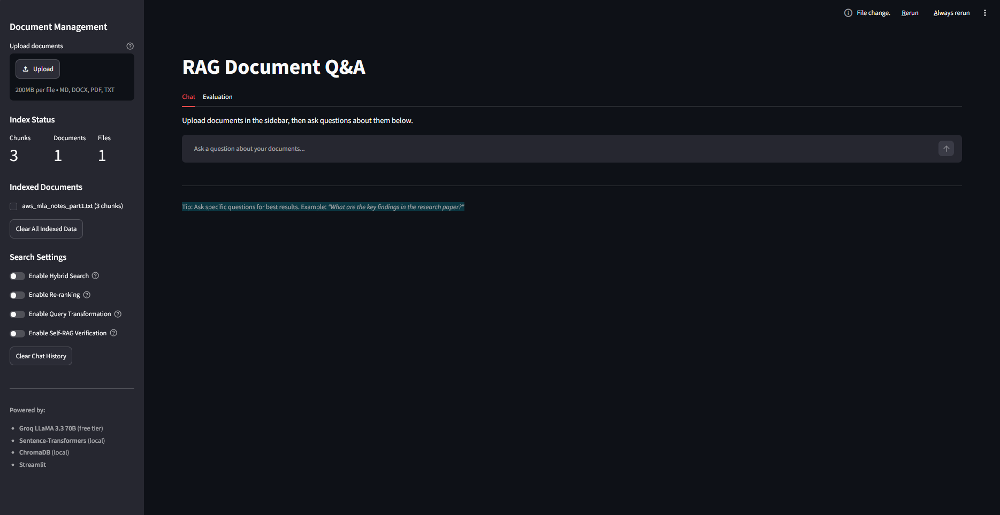
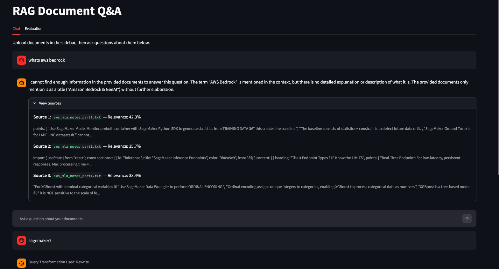
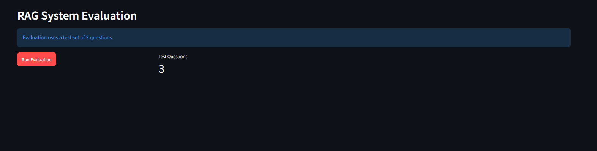

# RAG-Powered Document Q&A System

A modular Retrieval-Augmented Generation system that lets you upload PDFs, DOCX, TXT, and MD files, then ask natural language questions about their content. Uses local embeddings, persistent vector storage, and Groq's LLaMA 3.3 70B for high-speed inference.

---

## Built With

Groq, Streamlit, ChromaDB, Sentence-Transformers, Python

<p align="center">


<p>

---

## Tech Stack

| Layer | Technology | Purpose |
|---|---|---|
| Frontend | Streamlit | Web UI framework |
| LLM | Groq LLaMA 3.3 70B | Text generation (free tier) |
| Embeddings | Sentence-Transformers (all-MiniLM-L6-v2) | Local CPU vector generation |
| Re-ranker | Cross-Encoder (ms-marco-MiniLM-L-6-v2) | Query-chunk relevance scoring |
| Vector DB | ChromaDB | Local persistent storage |
| Keyword Search | BM25 (custom) | Exact keyword matching |
| Language | Python 3.10+ | — |
| Hosting | Hugging Face Spaces / Streamlit Cloud | Free deployment |

---

## Pipeline

```
Upload File -> Parse Text -> Split into Chunks -> Generate Embeddings -> Store in ChromaDB

Ask Question -> Rewrite/Decompose Query -> Generate Embedding -> Hybrid Search (Dense + BM25)
                                                                              |
                                                                         Re-rank with Cross-Encoder
                                                                              |
                                                              Build Prompt with Top Chunks as Context
                                                                              |
                                                                         Groq LLaMA 3.3 70B
                                                                              |
                                                                  Self-RAG: Verify Against Context
                                                                              |
                                                                  Display Answer + Source Citations
```

---

## Features

- **Multi-Format Parsing**: PDF, DOCX, TXT, MD
- **Semantic Chunking**: Splits at paragraph, line, and sentence boundaries with configurable overlap
- **Local Embeddings**: Sentence-Transformers (all-MiniLM-L6-v2) on CPU — no API cost, works offline
- **Persistent Vector Store**: ChromaDB for local query matching
- **Hybrid Search**: Dense (semantic) + BM25 (keyword) retrieval fused via Reciprocal Rank Fusion
- **Cross-Encoder Re-ranking**: Second-pass precision scoring on retrieved candidates
- **Query Transformation**: Rewrites ambiguous queries, decomposes multi-part questions, generates hypothetical documents for vague searches
- **Groq LLaMA 3.3 70B**: Low-latency streaming inference via Groq SDK
- **Self-RAG Verification**: Fact-checks generated answers against source context; re-retrieves and regenerates if unsupported claims are found
- **Conversation Memory**: Maintains multi-turn context for coherent follow-ups
- **Source Attribution**: Displays exact document passages and relevance scores for each answer
- **Streaming Responses**: Token-by-token output as generated
- **Evaluation Dashboard**: Quantitative metrics — faithfulness, answer relevancy, context recall, hit rate, latency

---

## Visual





---


## Project Structure

```
rag-doc-qa/
├── app.py               Streamlit frontend
├── ingest.py            Parse -> chunk -> embed -> store
├── retrieval.py         Hybrid search + cross-encoder re-ranking
├── query.py             Query transformation + LLM generation
├── self_rag.py          Fact-checking and self-correction loop
├── evaluation.py        Benchmarking and metrics
├── config.py            Central configuration
├── requirements.txt     Dependencies
├── .env                 API key (GROQ_API_KEY)
├── .gitignore
├── sample_docs/         Test files
└── chroma_db/           Auto-created vector store
```

---

## Quick Start

### 1. Get a Free Groq API Key

Go to [console.groq.com/keys](https://console.groq.com/keys), sign in, create a key (starts with `gsk_...`).

### 2. Setup

```bash
cd rag-doc-qa
python -m venv venv && source venv/bin/activate   # Linux/macOS
# venv\Scripts\activate                            # Windows
pip install -r requirements.txt
echo "GROQ_API_KEY=gsk_your_key_here" > .env
```

### 3. Run

```bash
streamlit run app.py
```

Open **http://localhost:8501**.

---

## How to Use

1. **Upload files** via the sidebar (PDF, DOCX, TXT, MD). System auto-extracts, chunks, embeds, and indexes.
2. **Toggle features** in the sidebar: Hybrid Search, Re-ranking, Query Transformation, Self-RAG.
3. **Ask questions** in the chat input. Answers stream token-by-token.
4. **View sources** in the collapsible dropdown beneath each answer.

### Example Questions (after indexing sample_docs/ai_in_education.md)

- "What are the key benefits of personalized learning mentioned in the document?"
- "Which company developed the MATHIA tutoring system?"
- "Summarize the challenges facing AI adoption in education."
- "What is the projected market size for AI in education by 2027?"

---

## Configuration

All settings in `config.py`:

| Parameter | Default | Description |
|---|---|---|
| `GROQ_MODEL` | `llama-3.3-70b-versatile` | Groq LLM |
| `EMBEDDING_MODEL` | `all-MiniLM-L6-v2` | Embeddings model |
| `CROSS_ENCODER_MODEL` | `ms-marco-MiniLM-L-6-v2` | Re-ranker model |
| `CHUNK_SIZE` | `800` | Target words per chunk |
| `CHUNK_OVERLAP` | `150` | Overlap between chunks |
| `TOP_K_RESULTS` | `4` | Chunks sent to LLM |
| `HYBRID_SEARCH_K` | `20` | Candidates before re-ranking |
| `ENABLE_MEMORY` | `True` | Multi-turn context |
| `MAX_SELF_RAG_ITERATIONS` | `2` | Max correction loops |

---

## CLI Utilities

```bash
python ingest.py path/to/document.txt
python query.py "What are the main results discussed?"
```

---

## Evaluation Metrics

| Metric | Definition |
|---|---|
| Faithfulness | % of answer claims supported by context |
| Answer Relevancy | Does the answer address the question? |
| Context Recall | Is ground truth present in retrieved chunks? |
| Hit Rate | Was the expected source document retrieved? |
| Latency | End-to-end response time |

Run from the **Evaluation** tab in the app.

---

## Deployment (Free for now)

### Hugging Face Spaces
Push to GitHub, create a Space (Streamlit SDK), add `GROQ_API_KEY` as a secret.

### Streamlit Community Cloud
Push to GitHub, deploy from [share.streamlit.io](https://share.streamlit.io), add `GROQ_API_KEY` in Secrets.

---

## License

MIT